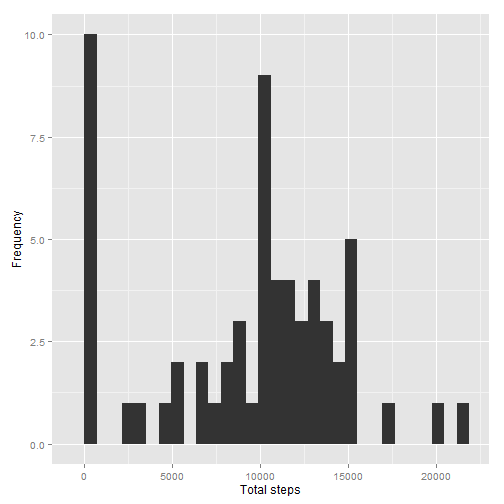
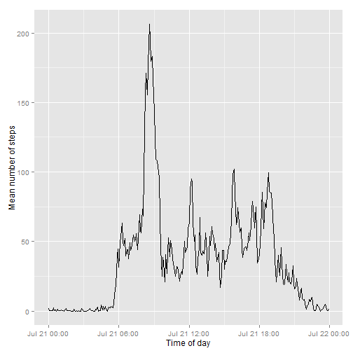
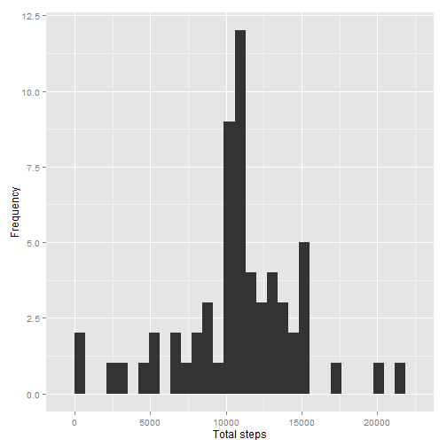
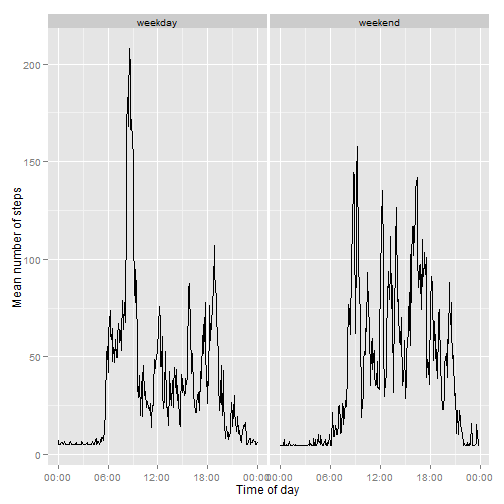

Assignment 1
============


For loading & preprocessing the data in Rstudio:


```r
act <- read.csv('activity.csv')
```

Creating a new a date-time column as dt:


```r
t <- formatC(act$interval / 100, 2, format='f')

act$dt <- as.POSIXct(paste(act$date, t),
                                 format='%Y-%m-%d %H.%M',
                                 tz='GMT')
```

Means & Median at the different times of day:


```r
act$time <- format(act$dt, format='%H:%M:%S')
act$time <- as.POSIXct(act$time, format='%H:%M:%S')

s <- tapply(act$steps, act$date, sum, na.rm=TRUE)

mean(s)
```

```
## [1] 9354
```

```r
median(s)
```

```
## [1] 10395
```

Histogram for total number of steps per day:


```r
library(ggplot2)
```

```
## Warning: package 'ggplot2' was built under R version 3.1.1
```

```r
qplot(s, xlab='Total steps', ylab='Frequency')
```

```
## stat_bin: binwidth defaulted to range/30. Use 'binwidth = x' to adjust this.
```

 

Mean steps for each five minute interval:


```r
mean.s <- tapply(act$steps, act$time, mean, na.rm=TRUE)
daily.pattern <- data.frame(time=as.POSIXct(names(mean.s)),
                            mean.s=mean.s)
```

Time series plot:


```r
library(scales)
```

```
## Warning: package 'scales' was built under R version 3.1.1
```

```r
ggplot(daily.pattern, aes(time, mean.s)) + 
    geom_line() +
    xlab('Time of day') +
    ylab('Mean number of steps')
```

 

```r
    scale_x_datetime(labels=date_format(format='%H:%M'))
```

```
## continuous_scale(aesthetics = aesthetics, scale_name = "datetime", 
##     palette = identity, breaks = breaks, minor_breaks = minor_breaks, 
##     labels = ..1, expand = expand, trans = "time", guide = "none")
```

Highest mean number of steps:


```r
most <- which.max(daily.pattern$mean.s)
format(daily.pattern[most,'time'], format='%H:%M')
```

```
## [1] "08:35"
```


Imputing missing values.


Calculate the total number of missing values in the dataset:


```r
summary(act$steps)
```

```
##    Min. 1st Qu.  Median    Mean 3rd Qu.    Max.    NA's 
##     0.0     0.0     0.0    37.4    12.0   806.0    2304
```

Strategy for filling in all of the missing values in the dataset:


```r
library(Hmisc)
```

```
## Warning: package 'Hmisc' was built under R version 3.1.1
```

```
## Loading required package: grid
## Loading required package: lattice
## Loading required package: survival
## Loading required package: splines
## Loading required package: Formula
```

```
## Warning: package 'Formula' was built under R version 3.1.1
```

```
## 
## Attaching package: 'Hmisc'
## 
## The following objects are masked from 'package:base':
## 
##     format.pval, round.POSIXt, trunc.POSIXt, units
```

```r
act.imputed <- act
act.imputed$steps <- with(act.imputed, impute(steps, mean))
```

Creating a new dataset that is equal to the original dataset but with the missing data filled in:


```r
s.imputed <- tapply(act.imputed$steps, 
                              act.imputed$date, sum)
mean(s)
```

```
## [1] 9354
```

```r
mean(s.imputed)
```

```
## [1] 10766
```

```r
median(s)
```

```
## [1] 10395
```

```r
median(s.imputed)
```

```
## [1] 10766
```

Histogram of the total number of steps taken each day:


```r
qplot(s.imputed, xlab='Total steps', ylab='Frequency')
```

```
## stat_bin: binwidth defaulted to range/30. Use 'binwidth = x' to adjust this.
```

 


Are there differences in activity patterns between weekdays and weekends?


Creating a new factor variable in the dataset with two levels - "weekday" and "weekend" indicating whether a given date is a weekday or weekend day.


```r
day.type <- function(date) {
    if (weekdays(date) %in% c('Saturday', 'Sunday')) {
        return('weekend')
    } else {
        return('weekday')
    }
}

day.types <- sapply(act.imputed$dt, day.type)

act.imputed$day.type <- as.factor(day.types)
```

Panel plot containing a time series:


```r
mean.s <- tapply(act.imputed$steps, 
                     interaction(act.imputed$time,
                                 act.imputed$day.type),
                     mean, na.rm=TRUE)

day.type.pattern <- data.frame(time=as.POSIXct(names(mean.s)),
                               mean.s=mean.s,
                               day.type=as.factor(c(rep('weekday', 288),
                                                   rep('weekend', 288))))

ggplot(day.type.pattern, aes(time, mean.s)) + 
    geom_line() +
    xlab('Time of day') +
    ylab('Mean number of steps') +
    scale_x_datetime(labels=date_format(format='%H:%M')) +
    facet_grid(. ~ day.type)
```

 
